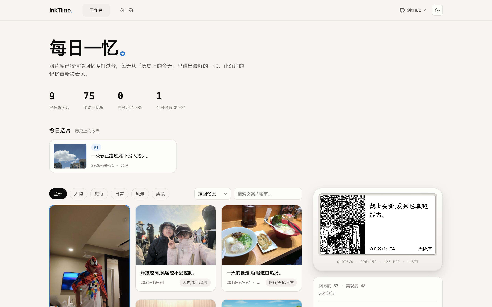
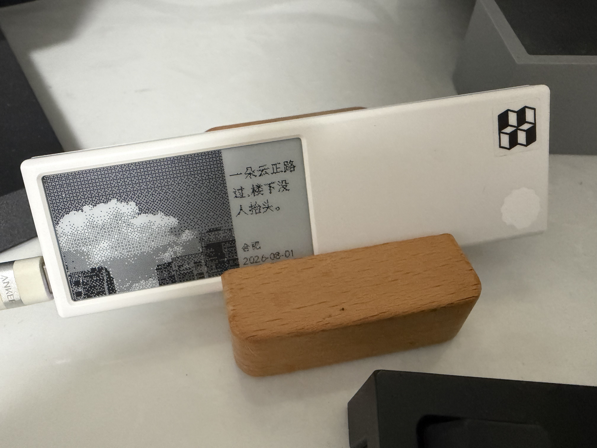
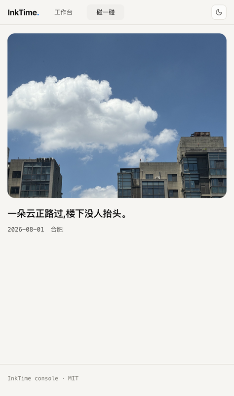

# InkTime · 会讲故事的墨水屏相框

一个完全运行在自己电脑上的小工具：它会用 AI 读懂你的照片，每天挑出最值得回味的一张，
配上一句文案，推送到桌上的墨水屏相框；手机碰一碰设备，就能看到那张照片的原图和故事。

<p align="center">
  
</p>
<p align="center"><i>工作台：画廊筛选 / 屏上文案即时编辑 / 墨水屏实时预览</i></p>

## 三步开始

### 第 1 步：安装（只需一次）

把下面两行命令复制粘贴到「终端」（macOS）或「PowerShell」（Windows）里：

```bash
python3 -m venv .venv && source .venv/bin/activate    # Windows 用户改为：.venv\Scripts\activate
pip install -r requirements.txt
```

### 第 2 步：告诉它照片在哪、用哪个 AI

复制 `config_example.py` 并改名为 `config.py`，打开填三样东西（都有中文注释）：

1. **照片在哪**：`IMAGE_DIR` 填你照片文件夹的路径，例如 `/Users/张三/Pictures/我的照片`
2. **结果存哪**：`DB_PATH` 是分析结果的保存文件，放在照片文件夹里就行，命名为 `photos.db`
   （和上面拼起来就是：`/Users/张三/Pictures/我的照片/photos.db`）
3. **AI 用哪家**：两种任选，格式都是 OpenAI 兼容的 `/v1/chat/completions`，区别主要在隐私——
   - **商用 API**：照片会上传到模型服务商的服务器分析。买一份视觉大模型的 key（阿里云/智谱等），
     填 `api_url`、`api_key`，`model_name` 填带视觉能力的模型名
   - **自建模型**：照片完全不出你的电脑。装 [LM Studio](https://lmstudio.ai)，下载视觉模型
     （如 `mlx-community/Qwen3.5-9B-6bit`，约 8GB）并在 Developer 页启动本地服务；`api_url` 填
     `http://127.0.0.1:1234/v1/chat/completions`，`api_key` 留空。对电脑性能要求较高：
     作者实测 M2 Pro / 16GB 内存，每张照片（两次调用）约 2 分钟

### 第 3 步：跑起来

```bash
python3.11 analyze_photos.py    # 分析照片：第一次要等一会儿，中断了再跑会自动接续
python3.11 app.py               # 打开控制台：http://127.0.0.1:8788
                                # 服务常驻期间，每天早上还会自动推送（见下文「每天自动推送」）
```

> **小技巧：先拿几张照片试水**
> 从照片库里挑十来张，拷到一个新文件夹（比如桌面上的 `测试照片`），只分析这一小批：
>
> ```bash
> python3.11 analyze_photos.py ~/Desktop/测试照片          # 只分析这个文件夹
> python3.11 analyze_photos.py ~/Desktop/测试照片 --limit 5  # 再省一点：只处理前 5 张
> ```
>
> 跑完打开控制台看看效果，满意了再把整个照片库交给它。

打开控制台后：左边是照片画廊，右边是墨水屏预览，点「推送到设备」即可。
想推哪张点哪张，屏上文案也可以随手改。

### 让墨水屏收到推送

需要一个 [Dot. Quote/0](https://dot.mindreset.tech) 墨水屏，并在 `config.py` 里填上设备凭证（App 里可以查到）：

```python
DOT_API_KEY = "dot_app_XXXX"    # Dot. App → 更多 → API Key → 创建
DOT_DEVICE_ID = "设备序列号"
```

另有两个可选项（都不填也能用）：`DOT_TASK_KEY` 在设备上有多个「图像 API」内容时指定推给哪个；
`DOT_TASK_ALIAS` 给内容起个看得懂的显示名，会出现在 Dot. App 的任务列表里。

| Quote/0 实机 | 碰一碰手机端 |
|:---:|:---:|
|  |  |

*左：Quote/0 实机正在展示推送的照片与画外之意；右：手机 NFC 碰一碰打开的回看页面*

### 每天自动推送（可选）

定时器就长在控制台服务里：`app.py` 常驻时，每天到点自动挑一张「历史上的今天」推到屏上，
不需要 launchd / crontab。默认每天 08:00，想改时间或不想要自动推送，在 `config.py` 里加：

```python
AUTO_PUSH = False    # 关掉自动推送
PUSH_HOUR = 8        # 每天几点推（24 小时制）
PUSH_MINUTE = 0
```

Mac 睡眠错过了点，服务会在唤醒后补推；推送失败会隔 10 分钟自动重试。定时推送不强制翻屏：
照片先存进设备，等墨水屏自己的唤醒周期再把内容刷出来（省电、不吵）；控制台里手动点
「推送到设备」则是立刻刷新。推送前想先看看今天会选中哪张：

```bash
python3.11 daily_push.py --dry-run   # 只显示选片结果，不真推
python3.11 daily_push.py             # 手动立即推一次（今天推过会跳过，--force 强制再推）
```

选片规则（参考 [InkTime](https://github.com/dai-hongtao/InkTime)）：
先在「历史上的今天」里挑回忆分达标的照片，优先没推送过的；
今天没有合适的就往前一天天回退，最多一年；再没有就用全库最高分兜底。达标线用 `MEMORY_THRESHOLD`
调，每天张数用 `DAILY_COUNT` 调。

## 它能做什么

- **自动挑片**：AI 给每张照片打「回忆分」，每天从「历史上的今天」挑出最值得再看的一张
- **自动写文案**：为照片配一句 8~20 字的「画外之意」，不走套路、不灌鸡汤
- **定时+一键推送**：服务常驻时每天定时自动推当日照片上屏，控制台里也可以想推哪张点哪张，推送历史随时回看
- **碰一碰回看**：手机 NFC 触碰设备，打开一个页面看原图、文案、拍摄日期和城市
- **隐私可控**：照片和数据库都存在自己电脑上；选本地模型的话，照片不会经过任何云端

## 致谢

- [dai-hongtao/InkTime](https://github.com/dai-hongtao/InkTime) — 项目想法与照片分析思路
- [Dot.](https://dot.mindreset.tech) — Quote/0 墨水屏设备与 OpenAPI
- [ZinggJM/GxEPD2](https://github.com/ZinggJM/GxEPD2)、[Pillow](https://python-pillow.org/) — 墨水屏生态与图像处理
- 城市索引基于 [GeoNames](https://www.geonames.org/)（CC BY 4.0）制作；视觉语言取自 [dejev.app](https://dejev.app/zh-Hans)

## License

MIT
