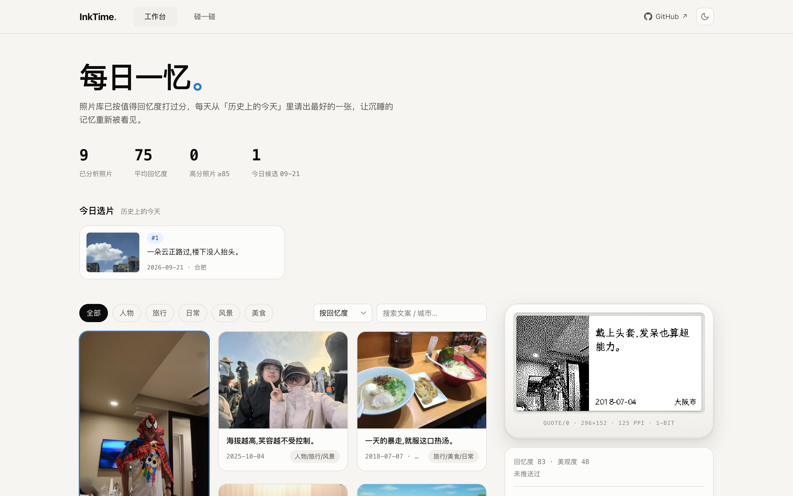
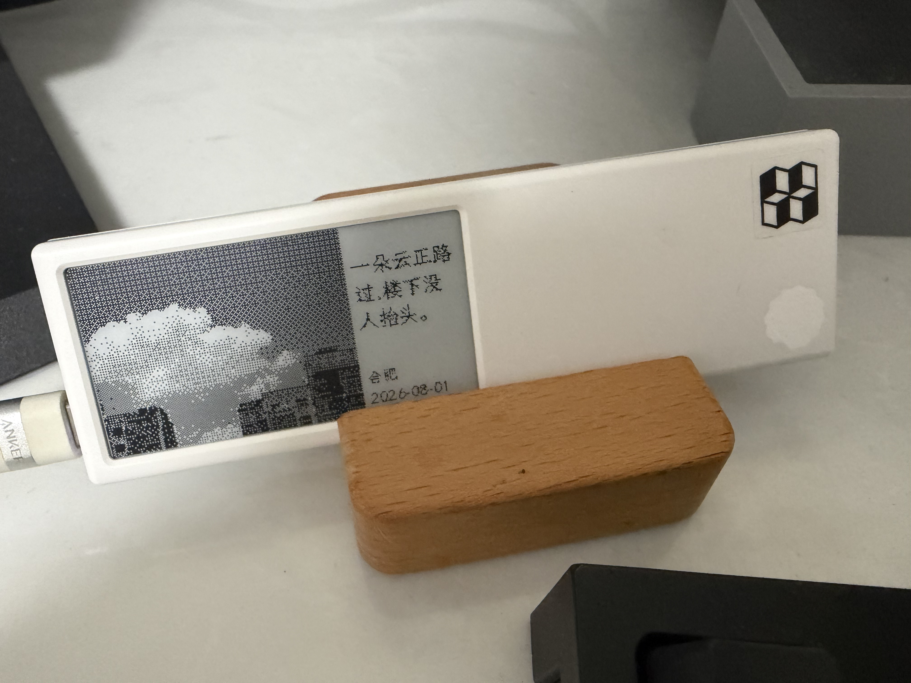
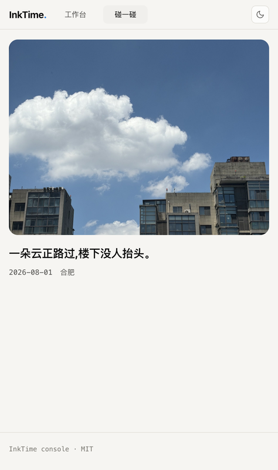

# InkTime · An e-ink photo frame that tells stories

English · [中文](README.zh-CN.md)

A small tool that runs entirely on your own computer: AI reads your photo library, picks the scene most worth revisiting each day, writes a one-line caption for it, and pushes it to the e-ink display on your desk. Tap the display with your phone to see the original photo and its story.

<p align="center">
  
</p>
<p align="center"><i>The workbench: gallery / on-screen caption editing / live e-ink preview</i></p>

## What it does

- **A memory a day** — every photo gets a 0–100 "memory score"; each morning the service picks the best not-yet-recalled scene from "on this day" in your library, walking back day by day when needed
- **Writes the caption** — an 8–20 character line of narration for the photo, explicitly prompted to avoid clichés and empty sentiment
- **Pushes on schedule or on demand** — the resident service pushes at a set time every day; in the console you can push any photo with one click; every push is recorded
- **Groups similar shots** — bursts and same-scene variants stack into one scene (dHash fingerprint + time clustering); you pick each stack's cover, pushes show the cover
- **Tap to recall** — touch a phone to the display and a page opens with the original photo, its caption, date and city
- **Private by design** — photos and the database stay on your machine; pick a local model and they never touch the cloud

## Quick start

Just want to look first? After the install in Step 1, `python3 mock/seed_mock.py` generates a batch of demo photos and their database, and `python3 app.py` serves the full console at http://127.0.0.1:8788 — no AI key, no photos of your own, no display needed.

### Step 1 · Install (once)

Paste these two commands into Terminal (macOS) or PowerShell (Windows):

```bash
python3 -m venv .venv && source .venv/bin/activate    # Windows users: .venv\Scripts\activate
pip install -r requirements.txt
```

Recommended alongside: [exiftool](https://exiftool.org/), which turns photo GPS data into city names. Without it everything still works, just without locations.

```bash
brew install exiftool    # Windows: choco install exiftool · Debian/Ubuntu: sudo apt-get install libimage-exiftool-perl
```

### Step 2 · Tell it where your photos are and which AI to use

Copy `config_example.py` to `config.py` and fill in three things (all commented in Chinese):

1. **Where your photos are**: `IMAGE_DIR`, e.g. `/Users/you/Pictures/MyPhotos`
2. **Where results go**: `DB_PATH`, the file holding analysis results — putting it in the photo folder is fine, named `photos.db`
   (joined with the above: `/Users/you/Pictures/MyPhotos/photos.db`)
3. **Which AI**: any OpenAI-compatible `/v1/chat/completions` vision endpoint. The main difference is privacy —
   - **Commercial API**: photos are uploaded to the model provider's servers for analysis. Buy a vision-model key (Zhipu, Aliyun, etc.), then fill `api_url`, `api_key`, and a multimodal `model_name` (e.g. `glm-4.5v`)
   - **Local model**: photos never leave your computer. Install [LM Studio](https://lmstudio.ai), download a vision model (e.g. `mlx-community/Qwen3.5-9B-6bit`, ~8 GB) and start the server on the Developer page; set `api_url` to `http://127.0.0.1:1234/v1/chat/completions` and leave `api_key` empty. Demands a beefy machine: the author measured ~2 minutes per photo (two model calls) on an M2 Pro with 16 GB

`API_CHANNELS` is a list in priority order — when a channel fails or rate-limits, the next one is tried automatically.

### Step 3 · Run

```bash
python3.11 analyze_photos.py    # analyze the library: slow the first time; interrupted runs resume where they left off
python3.11 app.py               # open the console: http://127.0.0.1:8788
                                # while the service runs, it also auto-pushes daily (see below)
```

In the console: photo gallery on the left, live display preview on the right — click "Push to device" on anything you like, and edit the on-screen caption in place.

> **Tip: trial it on a handful of photos first**
> Pick a dozen or so photos, copy them to a new folder (say `test-photos` on your Desktop), and analyze just that batch:
>
> ```bash
> python3.11 analyze_photos.py ~/Desktop/test-photos          # only this folder
> python3.11 analyze_photos.py ~/Desktop/test-photos --limit 5  # even cheaper: first 5 photos only
> ```
>
> Open the console, like what you see, then hand it the whole library.

### Getting pushes onto the display

You need a [Dot. Quote/0](https://dot.mindreset.tech) e-ink display, and its credentials in `config.py` (find them in the Dot. App):

```python
DOT_API_KEY = "dot_app_XXXX"    # Dot. App → More → API Key → Create
DOT_DEVICE_ID = "device serial number"
```

Two optional settings (everything works without them): `DOT_TASK_KEY` selects which "Image API" content item to push to when the device has several; `DOT_TASK_ALIAS` gives the content a readable name in the Dot. App's task list.

| Quote/0 in the flesh | Tap-to-view on a phone |
|:---:|:---:|
|  |  |

*Left: a Quote/0 showing the pushed photo and its caption; right: the recall page opened by tapping the phone on the display*

Note: tap-to-view links point at this computer's LAN IP (port 8788), recorded at push time — the phone must be on the same network, and old links stop working if the computer's IP changes.

### Daily automatic push (optional)

The scheduler lives inside the console service: while `app.py` is running it picks a scene from "on this day" and pushes it at a set time — no launchd / crontab needed. Default is 08:00 daily; to change the time or switch auto-push off, add to `config.py`:

```python
AUTO_PUSH = False    # turn off automatic pushes
PUSH_HOUR = 8        # hour of day to push (24-hour clock)
PUSH_MINUTE = 0
```

If the Mac was asleep at the appointed time, the push happens right after wake-up; failed pushes retry automatically after 10 minutes. A scheduled push does not force a screen refresh: the image is stored on the device and appears at the display's own next wake cycle (saves power, no surprises); pressing "Push to device" in the console refreshes immediately. To preview what today's push would pick:

```bash
python3.11 daily_push.py --dry-run   # show the pick, don't push
python3.11 daily_push.py             # push now (skips if today already pushed; --force overrides)
python3.11 daily_push.py --date 2024-10-01 --dry-run   # rehearse another day
```

How picks are made, briefly: candidates work in **scenes** — a stack of similar photos counts as one scene, a lone photo is its own. The picker first looks for a qualifying scene you haven't recalled yet on this calendar day across the years (walking back one day at a time, up to a year), then falls back to the least-recently-recalled scene, and finally to the library's top-scored photos. Tune the bar with `MEMORY_THRESHOLD` and the number of photos per day with `DAILY_COUNT`. The full rules live in [docs/photo-selection.md](docs/photo-selection.md) (Chinese).

## Project docs

- [docs/photo-selection.md](docs/photo-selection.md) — scene stacking and daily-pick rules in full (Chinese)
- [docs/CHANGELOG.md](docs/CHANGELOG.md) — release history (Chinese)

## Acknowledgments

- [dai-hongtao/InkTime](https://github.com/dai-hongtao/InkTime) — the project idea and photo-analysis approach
- [Dot.](https://dot.mindreset.tech) — the Quote/0 e-ink display and its OpenAPI
- [ZinggJM/GxEPD2](https://github.com/ZinggJM/GxEPD2), [Pillow](https://python-pillow.org/) — the e-ink ecosystem and image processing
- The city index is built on [GeoNames](https://www.geonames.org/) (CC BY 4.0); the visual language borrows from [dejev.app](https://dejev.app/zh-Hans)

## License

MIT
